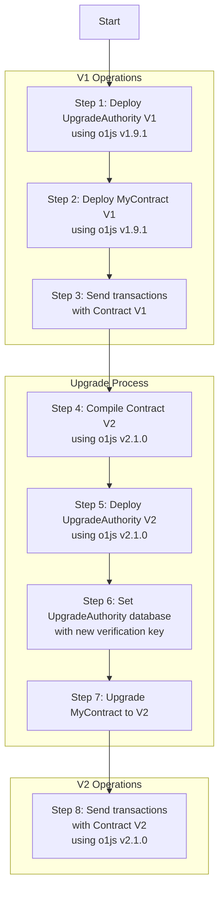

# Mina Upgradeable Contract Example

This end-to-end example demonstrates how to deploy and upgrade an upgradeable contract on Mina.
The contract is deployed using o1js v1.9.1 and upgraded to use o1js v2.1.0 by upgrading its verification key using the UpgradeAuthority contract and private voting of the validators on the new UpgradeAuthority database that contains the new verification key.

## Workflow



## Example of txs on Mina Devnet

### Contract

https://minascan.io/devnet/account/B62qpvuAun7S7eAgNuV1znZNtzbpSbBrUnoHhDF9tbeSdewzy1oShaH/zk-txs

### UpgradeAuthority

https://minascan.io/devnet/account/B62qjM47Bjr5HQTYyjCZ4TbDzZYwy9QVwnYxCjDiKEsQhMNfssTENmY/zk-txs
https://minascan.io/devnet/account/B62qqEQYk9qez97UCNriSQuRnTsFVai8EofjQ5vLxEqdtmi9RMB7znY/zk-txs

## Install

```sh
git clone https://github.com/dfstio/upgrade-example
cd upgrade-example
npm install
```

### Create a .env file

Use .env.example as a reference, fund your private key and get IPFS JWT key at pinata.cloud

### Clear data folder

Delete all the files in the data folder, they will be recreated by the scripts.

## Step 1: Deploy UpgradeAuthority

```sh
npm run deploy:upgrade
```

```
Deploying UpgradeAuthority V1...
o1js version 1.9.1
sender B62qoJru6gEjwCpojF6U7fVbbt2XE8ERHz7LTvkGmNVJ6A54RcPcQaf
Sender's balance 294n
UpgradeAuthority B62qjM47Bjr5HQTYyjCZ4TbDzZYwy9QVwnYxCjDiKEsQhMNfssTENmY
Compiling contracts
Compiled contracts: 9.839s
saveToIPFS result: {
  IpfsHash: 'bafkreih7ulvmjyrqmnfy6tie65rknpi5kk5mwrwp2742tslkid3u3ukoca',
  PinSize: 2223,
  Timestamp: '2024-12-10T08:14:49.225Z'
}
deploy tx sent {
  status: 'pending',
  hash: '5JuK34hW36MvRxzHW2BnWqu8djDqEuXmNBAX74nJWuixVvJsdHDw',
  errors: []
}
deployed UpgradeAuthority: 25.438s
```

The UpgradeAuthority contract is deployed and the upgrade-v1.json file is created in the data folder.

## Step 2: Deploy MyContract using o1js v1.9.1

```sh
npm run deploy:contract
```

```
Deploying MyContract...
o1js version 1.9.1
sender B62qoJru6gEjwCpojF6U7fVbbt2XE8ERHz7LTvkGmNVJ6A54RcPcQaf
Sender's balance 294n
MyContract B62qpvuAun7S7eAgNuV1znZNtzbpSbBrUnoHhDF9tbeSdewzy1oShaH
UpgradeAuthority B62qjM47Bjr5HQTYyjCZ4TbDzZYwy9QVwnYxCjDiKEsQhMNfssTENmY
Compiling contract
Compiled contract: 1.617s
deploy tx sent {
  status: 'pending',
  hash: '5JtkDYjn3d3G58SXbe5m7uBfEnvvevzZ25NPxD7Xih8C4LeP994b',
  errors: []
}
deployed MyContract: 3.670s
Waiting for tx to be included in a block...
tx status: included
```

The MyContract is deployed and the contract.json file is created in the data folder.

## Step 3: Send contract V1 transactions

```sh
npm run tx:v1
```

```
Sending tx with contract V1
sender B62qoJru6gEjwCpojF6U7fVbbt2XE8ERHz7LTvkGmNVJ6A54RcPcQaf
Sender's balance 292n
MyContract B62qpvuAun7S7eAgNuV1znZNtzbpSbBrUnoHhDF9tbeSdewzy1oShaH
Compiling contract
Compiled contract: 1.595s
Setting value 2871
tx sent {
  status: 'pending',
  hash: '5Ju6H86joLcJV84hQ7SbyL3khmu8VrgDTXSDs71UhLKmfuLPPuVK',
  errors: []
}
Waiting for tx to be included in a block...
tx status: included`

```

## Step 4: Compile contract V2

```sh
npm run compile:v2
```

```
Compiling contract V2
Compiled contract: 1.549s
```

The output will be in vk-v2.json in the data folder

## Step 5: Deploy UpgradeAuthority V2

```sh
npm run deploy:upgrade-v2
```

```
Deploying UpgradeAuthority V2...
o1js version 2.1.0
sender B62qoJru6gEjwCpojF6U7fVbbt2XE8ERHz7LTvkGmNVJ6A54RcPcQaf
Sender's balance 292n
UpgradeAuthority B62qqEQYk9qez97UCNriSQuRnTsFVai8EofjQ5vLxEqdtmi9RMB7znY
Compiling contracts
Compiled contracts: 50.976s
saveToIPFS result: {
  IpfsHash: 'bafkreigljbiifcrfihabj2arokc3ua7zwjm3meomslswvmlre2cifnogui',
  PinSize: 2217,
  Timestamp: '2024-12-10T08:40:19.733Z'
}
deploy tx sent {
  status: 'pending',
  hash: '5JuoK1JbwZ9N1sd2u7GrE2DtXtmQEFm6mq1MHbX3vJ5dGfNjgAJZ',
  errors: []
}
deployed UpgradeAuthority: 1:07.828 (m:ss.mmm)
```

The upgrade-v2.json file is created in the data folder

## Step 6: Set UpgradeAuthority database with new MyContract V2 verification key

```sh
npm run set:db
```

```
Setting UpgradeAuthority database...
o1js version 1.9.1
sender B62qoJru6gEjwCpojF6U7fVbbt2XE8ERHz7LTvkGmNVJ6A54RcPcQaf
Sender's balance 291n
UpgradeAuthority B62qjM47Bjr5HQTYyjCZ4TbDzZYwy9QVwnYxCjDiKEsQhMNfssTENmY
UpgradeAuthorityV2 B62qqEQYk9qez97UCNriSQuRnTsFVai8EofjQ5vLxEqdtmi9RMB7znY
Compiling contracts
Compiled contracts: 9.463s
storage bafkreih7ulvmjyrqmnfy6tie65rknpi5kk5mwrwp2742tslkid3u3ukoca
saveToIPFS result: {
  IpfsHash: 'bafkreiebmtuh5ix2w5eb3voirhc4uldkrbjdmanh543zwkvab6vmpyuvmq',
  PinSize: 1387,
  Timestamp: '2024-12-10T09:08:37.602Z'
}
voting...
voted: 40.466s
merging vote proofs...
merged vote proofs: 47.105s
set upgrade authority db tx sent {
  status: 'pending',
  hash: '5Jv7ULkkZgYFDzSH8g5efiCjAMc2M9Gbh1PiKXcTUE8CPgTYGpAX',
  errors: []
}
UpgradeAuthority database set: 2:01.184 (m:ss.mmm)
```

## Step 7: Upgrade MyContract to V2

```sh
npm run upgrade
```

```
Upgrading MyContract to V2
sender B62qoJru6gEjwCpojF6U7fVbbt2XE8ERHz7LTvkGmNVJ6A54RcPcQaf
Sender's balance 291n
MyContract B62qpvuAun7S7eAgNuV1znZNtzbpSbBrUnoHhDF9tbeSdewzy1oShaH
Compiling contracts
Compiled contracts: 10.530s
UpgradeAuthority B62qjM47Bjr5HQTYyjCZ4TbDzZYwy9QVwnYxCjDiKEsQhMNfssTENmY
Creating and proving transaction...
tx sent {
  status: 'pending',
  hash: '5Ju9GeC7Mg47kiWNDWjCiEgvnHTpK9hezX5DzhSj1mSqbRyBNGuu',
  errors: []
}
Upgraded MyContract: 34.826s
```

## Step 8: Send contract V2 transactions

```sh
npm run tx:v2
```

```
Sending tx with contract V2
sender B62qoJru6gEjwCpojF6U7fVbbt2XE8ERHz7LTvkGmNVJ6A54RcPcQaf
Sender's balance 291n
MyContract B62qpvuAun7S7eAgNuV1znZNtzbpSbBrUnoHhDF9tbeSdewzy1oShaH
Compiling contract
Compiled contract: 1.591s
Setting value 4797
tx sent {
  status: 'pending',
  hash: '5JvK77LXepHyZygDePhhsa6XGK6kmR2smWz42MprpQrvbmo8dUPG',
  errors: []
}
Waiting for tx to be included in a block...
tx status: included


```
